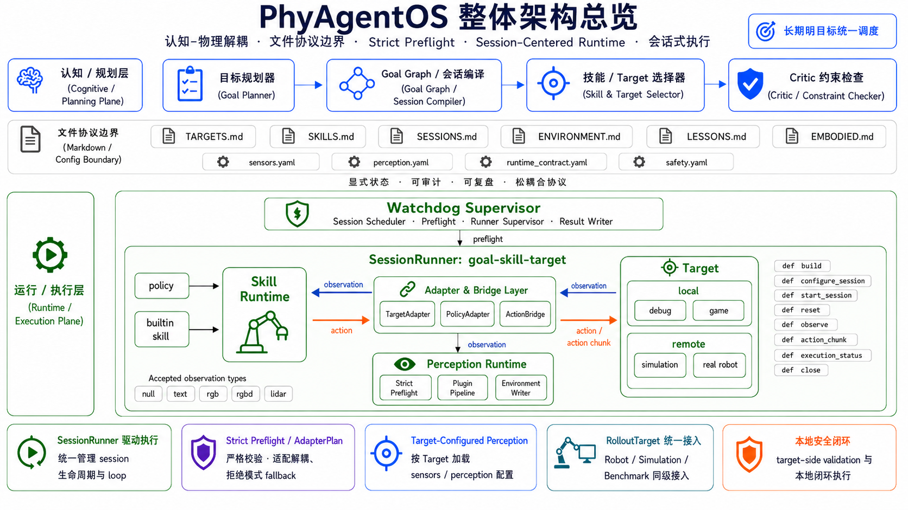
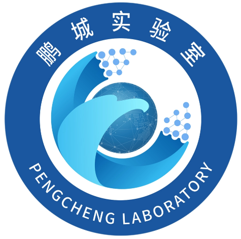

<div align="center">
  

  <h3>Cognitive-Physical Decoupling — A Session-Centered Runtime for Embodied Intelligence</h3>

  <p>
    <a href="https://github.com/PhyAgentOS/PhyAgentOS/stargazers">
      
    </a>
    <a href="https://github.com/PhyAgentOS/PhyAgentOS/network/members">
      
    </a>
  </p>
  <p>
    
    
    <a href="https://phy-agent-os.net/">
      
    </a>
    <a href="https://github.com/PhyAgentOS/PhyAgentOS">
      
    </a>
  </p>
  <p>
    <sub><a href="./README.md">English</a> · <a href="./README_zh.md">中文</a></sub>
  </p>
</div>

---

## 📢 Changelog

| Version | Date | Update |
|:------|:-----|:-------|
|  | 2026-05-29 | Based on  — Minecraft ready: cloud agent connects to user's local server |
|  | 2026-05-25 | Strict separation of `PolicySkillRuntime` / `BuiltinSkillRuntime`; Game Agent & Benchmarking ready |
|  | 2026-05-20 | Perception plugin system: `SensorConfig` / `PerceptionConfig` YAML + `EnvironmentWriter` auditable writeback |
|  | 2026-05-18 | Session-Centered Runtime MVP: `DummySimTarget` + `DummyAdapter` + `DummyClient` serial pipeline |
|  | 2026-04-29 | Hackathon baseline: plugin-based HAL, ReKep / SAM3 real-robot grasping & VLN full pipeline |

---

## 🤔 Why PhyAgentOS?

Traditional "LLM-direct-to-hardware" approaches tightly couple reasoning to execution — switching robots means rewriting the entire pipeline. PhyAgentOS changes this through **Cognitive-Physical Decoupling + Session-Centered Runtime**:

<table>
<tr><td width="32">🔌</td><td><b>One Codebase, Any Hardware</b> — Adding a new robot means implementing one Target Adapter (~100 lines); zero changes to the scheduling layer.</td></tr>
<tr><td>🛡️</td><td><b>Three Safety Layers</b> — Critic validation → Strict Preflight → Target-side SafetyGuard; mandatory for real-robot deployment.</td></tr>
<tr><td>📋</td><td><b>Fully Auditable</b> — State, actions, and perception results are written to Markdown + YAML files; every step is traceable and reproducible.</td></tr>
<tr><td>🔄</td><td><b>Zero-Friction Migration</b> — The same Session protocol runs identically across sim, real, and game targets.</td></tr>
</table>

<br>

<div align="center">
  
  <p><sub>▲ Session-Centered Runtime Architecture Overview</sub></p>
</div>

---

## ✨ Core Features

<table>
<tr>
  <td width="32">🔄</td>
  <td width="165"><b>Session-Centered Runtime</b></td>
  <td><code>WatchdogSupervisor</code> → <code>SessionRunner</code> → <code>SkillRuntime</code> → <code>TargetSessionHandle</code> execution pipeline, replacing the legacy Driver-Center architecture</td>
</tr>
<tr>
  <td>🎯</td>
  <td><b>Target-Configured</b></td>
  <td>Four target kinds — <code>game</code> / <code>debug</code> / <code>simulation</code> / <code>real_robot</code> — registered in <code>TARGETS.md</code>, adapters attached on demand</td>
</tr>
<tr>
  <td>🧩</td>
  <td><b>Adapter + Bridge</b></td>
  <td><code>TargetAdapter</code> + <code>PolicyAdapter</code> + <code>ActionBridge</code> three-way decoupling; <code>AdapterPlan</code> auto-composed, eliminating target×skill combinatorial explosion</td>
</tr>
<tr>
  <td>⚡</td>
  <td><b>Dual Skill Runtimes</b></td>
  <td><code>PolicySkillRuntime</code> maintains policy closed-loop + <code>BuiltinSkillRuntime</code> manages agent interactive loop</td>
</tr>
<tr>
  <td>🛡️</td>
  <td><b>Strict Preflight</b></td>
  <td>10 validation checks (target / sensor / perception / contract / tool); failures are <code>rejected</code> before execution starts</td>
</tr>
<tr>
  <td>📝</td>
  <td><b>File Protocol Matrix</b></td>
  <td><code>TARGETS.md</code> · <code>SKILLS.md</code> · <code>SESSIONS.md</code> · <code>ENVIRONMENT.md</code> · <code>LESSONS.md</code> + external YAML configs</td>
</tr>
<tr>
  <td>🔐</td>
  <td><b>Multi-Layer Safety</b></td>
  <td>Critic validation → Preflight contract checks → Target-side SafetyGuard → Operator Override</td>
</tr>
<tr>
  <td>🌐</td>
  <td><b>Fleet Mode</b></td>
  <td>Multi-robot coordination with shared + per-robot workspaces, priority-based serial scheduling</td>
</tr>
</table>

---

## 🚀 5-Minute Quick Start

<table>
<tr>
<td width="28" align="center">1</td>
<td>

**Install**

```bash
git clone https://github.com/PhyAgentOS/PhyAgentOS.git && cd PhyAgentOS
pip install -e .            # Python ≥ 3.11
pip install -e ".[dev]"     # Dev dependencies
```
</td>
</tr>
<tr>
<td align="center">2</td>
<td>

**Initialize Workspace**

```bash
paos onboard
```
</td>
</tr>
<tr>
<td align="center">3</td>
<td>

**Terminal 1: Start Runtime (Track B)**

```bash
python -m PhyAgentOS.runtime.watchdog
```
</td>
</tr>
<tr>
<td align="center">4</td>
<td>

**Terminal 2: Start Agent (Track A)**

```bash
paos agent
```
</td>
</tr>
</table>

Enter natural language commands in the Agent CLI to drive hardware. No hardware? Run the Smoke Test to verify the full pipeline:

```bash
python scripts/init_runtime_workspace.py --workspace /tmp/paos_runtime_smoke
python scripts/run_runtime_watchdog.py --workspace /tmp/paos_runtime_smoke --once
# → session marked succeeded, results written to artifacts/
```

---

## 📦 Project Structure

```
PhyAgentOS/
│
├── PhyAgentOS/agent/          # Track A  ─  Planner / Critic / Memory
│
├── PhyAgentOS/runtime/        # Track B  ─  Execution Plane
│   ├── watchdog/              #   WatchdogSupervisor
│   ├── sessions/              #   SessionRunner / TargetSessionHandle
│   ├── targets/               #   RolloutTarget (game·debug·sim·real)
│   ├── skills/                #   PolicySkillRuntime / BuiltinSkillRuntime
│   ├── adapters/              #   TargetAdapter / PolicyAdapter / Bridge
│   ├── perception/            #   Perception Runtime / EnvironmentWriter
│   ├── preflight/             #   RuntimeCompatibilityPreflight
│   └── schemas/               #   Pydantic Schema
│
├── configs/runtime/           # Sensor / Perception / Contract YAML
├── scripts/                   # Utility scripts
├── workspace/                 # Runtime workspace
├── docs/                      # Documentation
└── tests/                     # Tests
```

---

## 🏷️ Supported Targets

| | Kind | Location | Examples |
|:--|:-----|:-----|:-----|
| 🎮 | `game` | Local | Minecraft, Stardew Valley — low-cost validation of long-term decisions & memory |
| 🐛 | `debug` | Local | echo / mock / dry-run — zero-hardware protocol pipeline validation |
| 🧪 | `simulation` | Remote | RoboCasa, LIBERO — benchmark evaluation & batch experience mining |
| 🤖 | `real_robot` | Remote | Franka, Go2, XLeRobot, AgileX PIPER — real-world deployment |

> All targets are registered in `TARGETS.md`, identified by `target_adapter://` URI.
> More examples & demos → [Project Website](https://phy-agent-os.net/)

---

## 📖 Documentation

| Document | Audience | Description |
|:-----|:-----|:-----|
| [🌐 Website](https://phy-agent-os.net/docs/en/architecture.html) | Everyone | Full docs, architecture details, demos |
| [📘 User Manual](https://phy-agent-os.net/docs/en/api-reference.html) | Users | Installation, deployment, and operation guide |
| [📙 Dev Guide](https://phy-agent-os.net/docs/en/developer-guide.html) | Developers | Secondary development, hardware integration, plugin authoring |

---

## 🤝 Contributing

PRs and Issues are welcome! Check our development roadmap here → [Dev Plan](https://phy-agent-os.net/docs/en/developer-guide.html).

---

<div align="center">

Built on **[nanobot](https://github.com/HKUDS/nanobot)**

Jointly developed by **Sun Yat-sen University HCP Lab** & **Peng Cheng Laboratory**

<br>


&nbsp;&nbsp;&nbsp;

&nbsp;&nbsp;&nbsp;


<br>
<sub>MIT License · Copyright © 2025-2026 PhyAgentOS</sub>

</div>
